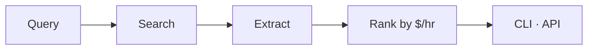

# Job Engine

Find roles, contracts, grants, and equity opportunities — ranked by compensation per hour.



## Get started

```bash
python3 -m pip install -e .

export OPENAI_API_KEY=sk-...
export BRAVE_API_KEY=BSA...        # optional
export PERPLEXITY_API_KEY=pplx-... # optional

job-engine "AI engineer"
```

## Overview

Every result is scored on one metric:

```text
annual_compensation ÷ (hours_per_week × 50)
```

Non-remote roles take a 30% penalty. Missing pay or hours are imputed conservatively so weak listings sink.

HTTP API:

```bash
job-engine serve
curl "http://localhost:8000/search?q=AI+engineer"
```

Web UI (Next.js):

```bash
job-engine serve          # terminal 1 — API on :8000
cd web && npm install && npm run dev   # terminal 2 — UI on :3000
```

Deploy the UI to Vercel with root directory `web`. Set `JOB_ENGINE_API_URL` to your API host.

## Reference

**Deploy.**

```bash
fly launch
fly secrets set OPENAI_API_KEY=... BRAVE_API_KEY=... PERPLEXITY_API_KEY=...
fly deploy
```

**Test.**

```bash
python3 -m pip install -e ".[dev]"
python -m pytest -q
```

MIT · [LICENSE](LICENSE)
