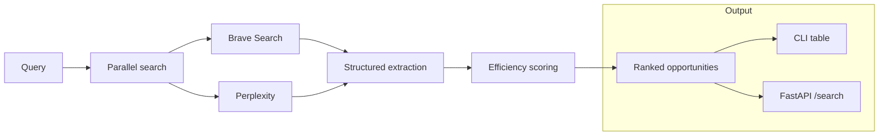

# Job Engine

Search for roles, contracts, grants, and equity opportunities. Results are normalized, scored, and ranked by effective **compensation per hour**.

## Architecture



## Scoring model

Each opportunity is scored on a single efficiency metric:

```text
score = annual_compensation / (hours_per_week × 50)
```

Non-remote roles receive a 30% penalty. Missing pay or hours are conservatively imputed so weak listings sink in the ranking.

## Quick start

```bash
python3 -m pip install -e .

export OPENAI_API_KEY=sk-...
export BRAVE_API_KEY=BSA...        # optional, improves coverage
export PERPLEXITY_API_KEY=pplx-... # optional, deep research pass

job-engine "AI engineer"
job-engine "python freelance"
job-engine "startup equity"
```

Example output:

```text
#   Title                         Company     Pay        Hrs    $/hr
1   Senior ML Engineer (Remote)   Acme AI     $220,000   30     $147
2   AI Consultant — Part Time     TechCorp    $180,000   20     $180
3   Python Contract — 6 months    StartupX    $150,000   25     $120
```

## HTTP API

```bash
job-engine serve
curl "http://localhost:8000/search?q=AI+engineer"
```

## Repository layout

```text
src/
├── engine.py   Search orchestration and ranking
├── models.py   Opportunity schema and scoring
├── cli.py      Typer CLI
└── api/        FastAPI routes
config/
└── settings.py Environment-backed configuration
```

## Deployment

```bash
fly launch
fly secrets set OPENAI_API_KEY=... BRAVE_API_KEY=... PERPLEXITY_API_KEY=...
fly deploy
```

## Development

```bash
python3 -m pip install -e ".[dev]"
python -m pytest -q
```

## License

MIT. See [LICENSE](LICENSE).
