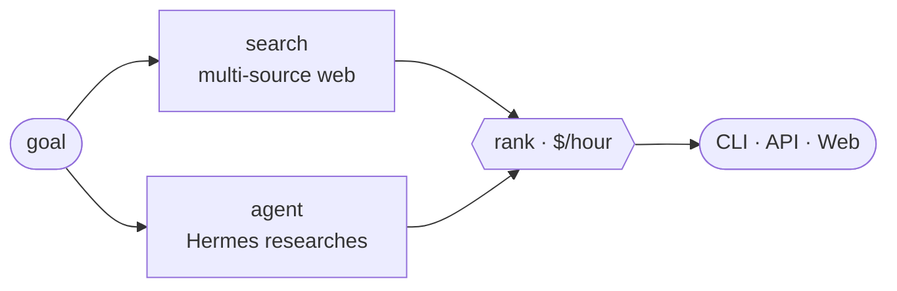
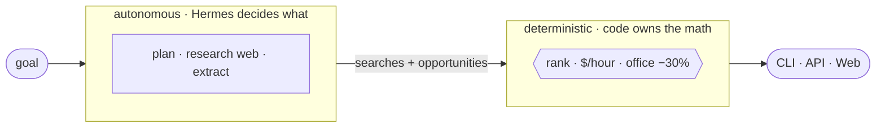

# Job Engine

Find roles, contracts, grants, and equity — ranked by what they truly pay per hour.



## Quickstart

```bash
pip install -e .
job-engine find "AI engineer"
```

Runs with zero configuration — it falls back to open web search. Add keys to sharpen results:

```bash
export OPENAI_API_KEY=sk-...     # structured extraction
export BRAVE_API_KEY=BSA...      # richer, faster search
```

## How it ranks

One number orders every result:

```text
$/hour  =  annual pay ÷ (hours per week × 50)
```

Office roles take a 30% penalty. Missing pay or hours are imputed conservatively, so thin listings sink to the bottom.

## Autonomous agent

Hand the search to an autonomous brain:

```bash
job-engine agent "senior ML contract, remote"
```

[**Hermes Agent**](https://github.com/NousResearch/hermes-agent) researches the open web on its own and returns candidates; Job Engine ranks them by $/hour. Requires a running Hermes server. See [docs/AGENT.md](docs/AGENT.md).



The brain decides *what* to surface; the deterministic core owns *the $/hour* — it never invents a number it's graded on.

## API & Web

```bash
job-engine serve                            # API → :8000
curl "localhost:8000/search?q=AI+engineer"
```

```bash
cd web && npm install && npm run dev        # UI → :3000
```

Deploy the UI to Vercel (root directory `web`); point `JOB_ENGINE_API_URL` at your API.

## Develop

```bash
pip install -e ".[dev]" && pytest -q
```

Deploy the API to Fly: `fly launch && fly deploy`.

---

MIT · [LICENSE](LICENSE)
