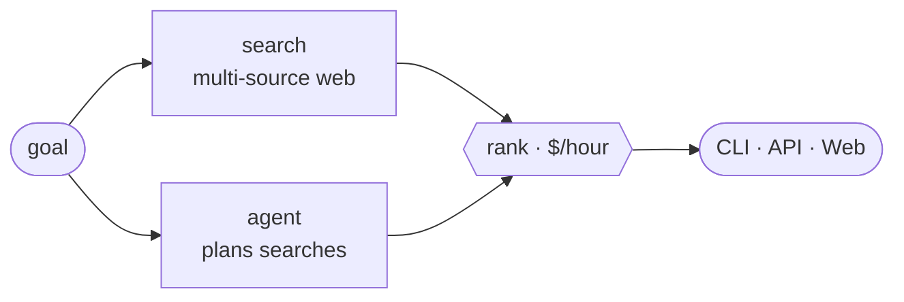
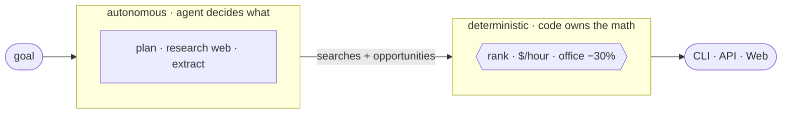

# Job Engine

Find roles, contracts, grants, and equity — ranked by what they truly pay per hour.


```mermaid
flowchart LR
  G([goal]) --> S[search<br/>multi-source web]
  G --> A[agent<br/>plans searches]
  S --> R{{rank · $/hour}}
  A --> R
  R --> O([CLI · API · Web])
```

## Quickstart

```bash
pip install -e .
job-engine find "AI engineer"
```

Runs with zero configuration — it falls back to open web search. Add keys to sharpen results:

```bash
export OPENAI_API_KEY=sk-...     # structured extraction
export BRAVE_API_KEY=BSA...      # richer, faster search
```

## How it ranks

One number orders every result:

```text
$/hour  =  annual pay ÷ (hours per week × 50)
```

Rank uses the midpoint of an employer-posted salary range, while CLI, API, and web retain the full range. ATS JSON takes priority over JobPosting schema and labeled listing copy. Search-snippet pay is marked `snippet`, stays unverified, and contributes no score until the listing confirms it. Custom career pages are fetched even when snippets contain pay, so embedded Greenhouse, Lever, and Ashby listings can be resolved.

A query containing `remote` or `work from home` requires affirmative remote evidence from the ATS, schema, or listing. Hybrid, onsite, and unknown arrangements are excluded before sorting and limiting, in both the engine and agent paths. Other queries retain the 30% office penalty. Remote navigation links and model guesses do not establish the job's arrangement.

Missing compensation remains unknown with score zero. Snippet-only hours cannot inflate the rate: missing or unverified hours impute 40/week and the rate is labeled approximate. Conversions from hourly or other non-annual rates are labeled annualized projections, not a posted annual salary. Bonuses, equity, commission-only figures, unknown pay intervals, and upper-only earning claims do not become base salary. API results include the pay source URL and work-arrangement provenance. Job-board search pages, category pages, and salary guides are dropped. Known aggregators and recruiter boards use `unverified` provenance until an employer ATS counterpart confirms the evidence.

These checks establish pay and work-arrangement evidence, not employer quality, role fit, or eligibility in a particular state.

## Autonomous agent

Hand the search to an autonomous brain:

```bash
job-engine agent "senior ML contract, remote"
```

The [OpenAI Agents SDK](https://openai.github.io/openai-agents-python/) plans its own web searches and returns candidates; Job Engine ranks them by $/hour. With no `OPENAI_API_KEY`, agent mode uses the same open-web engine as `find`. See [docs/AGENT.md](docs/AGENT.md).


```mermaid
flowchart LR
  G([goal]) --> A

  subgraph A[autonomous · agent decides what]
    H[plan · research web · extract]
  end

  A -->|searches + opportunities| D

  subgraph D[deterministic · code owns the math]
    R{{rank · $/hour · office −30%}}
  end

  D --> O([CLI · API · Web])
```

The brain decides *what* to surface; the deterministic core owns *the $/hour* — it never invents a number it's graded on.

## API & Web

```bash
job-engine serve                            # API → :8000
curl "localhost:8000/search?q=AI+engineer"
```

```bash
cd web && npm install && npm run dev        # UI → :3000
```

Both halves deploy to Vercel from this repo — the UI (root directory `web/`) and the API (repo root, FastAPI via Fluid Compute). Point the UI's `JOB_ENGINE_API_URL` at the API deployment.

## Develop

```bash
pip install -e ".[dev]" && pytest -q
```

---

MIT · [LICENSE](LICENSE)
